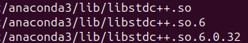

## Update ubuntu

```{bash}
sudo apt update
```

## Python Version 

- Note that Ubuntu 23.xx up comes with python preinstalled (to the best of my knowledge). I believe run something like:
```{bash}
python --version 
#exit()
```

## Python and Deps installation

- If python is not installed or you intend to use Anaconda then the next steps are relevant.
- A fun fact is Ubuntu unlike other environments often requires bash for installing some interesting (or weird) dependencies. I experienced some of these dependencies when setting up my R development environment in Ubuntu 23.xx.

```{bash}
sudo apt install golang python3-dev python-dev-is-python3 python3-pip libcupti-dev libjpeg-turbo8-dev libjpeg-dev make cmake tmux chromium-browser zlib1g-dev xvfb ffmpeg xorg-dev libboost-all-dev libsdl2-dev swig
#Packages and deps installed so far are below:
#golang
#python3-dev (same as python3)
#python-dev-is-python3
#python3-pip
#libcupti-dev *
#libjpegs
#make
#cmake
#tmux
#chrome
#zlib-dev
#xvfb (x virtual frame buffer is a display server that implements the X11 display protocol with no output shown)
#ffmpeg(https://launchpad.net/ubuntu/+source/libav/4:0.8.6-0ubuntu0.12.04.1; researched to see that the source file for libav builds this binary; the source was also downloaded in case)
#xorg
#libboost
#libsdl
#swig (connect c/c++ programs to higher level languages or scripting languages like python and also JS)
```

- Python opengl should be executed in a separate command
```{bash}
sudo apt install -y python3-opengl
python3 -m pip show pyopengl #check installation
#opengl installed here
```

## Anaconda Installation (https://docs.anaconda.com/free/anaconda/install/linux/)

- Personally i like to keep things simple. No need to have anaconda for using python when we already have python installed. Personally it messes things up and confuses the system.
- The only reason I will install this is because of the practice, to follow along with RL and also because the system I am using is a TEST system and not my mainstream developmental setup.

- Anaconda installation instructions can be found at their site.

### deps

```{bash}
sudo apt install libgl1
sudo apt install libglx-mesa0
#fulfills the crazy libegl1-mesa and libgl1-mesa-glx
sudo apt install libxrandr2 libxrandr2 libxss1 libxcursor1 libxcomposite1 libasound2 libxi6 libxtst6
#all deps above were already present
sudo apt install --reinstall libgl1-mesa-dri #libgl errs popping up
sudo apt install -y mesa-utils
#useful when anaconda had libgl problems
```

### download

```{bash}
curl -O https://repo.anaconda.com/archive/Anaconda3-2024.02-1-Linux-x86_64.sh
#versions list: https://repo.anaconda.com/archive/
#curl should be installed sudo apt install curl

pwd #find file; for some reason i dont see the file in pwd
shasum -a 256 Anaconda3-2024.02-1-Linux-x86_64.sh #check integrity
```


### install

```{bash}
bash Anaconda3-2024.02-1-Linux-x86_64.sh
#follow some prompts and install to Home location in linux equivalent to Documents in windows
source ~/.bashrc #term refresh
conda --version
```

### config 

```{bash}
source ~/anaconda3/bin/activate #~ = /home/swaggyt/...
conda init
```

```{bash}
conda config --set auto_activate_base false # or true
`conda init --reverse $SHELL`
```


## verify

```{bash}
anaconda-navigator
```

## fix libgl error- troubleshoot

```{bash}
conda install -c conda-forge libffi #foreign function interface == fix
conda update libstdcxx-ng #no need to run
cd ~/anaconda3/lib; ls -al | grep libstdc++
cd ~/anaconda3/pkgs/libstdcxx-ng-11.2.0-h1234567_1/lib; ls -al | grep libstdc++
cd ~/anaconda3/pkgs/libstdcxx-ng-13.2.0-h7e041cc_5/lib; ls -al | grep libstdc++ #from conda forge
rm -rf ~/anaconda3/pkgs/libstdcxx-ng-11.2.0-h1234567_1/lib
find ~/anaconda3 -name "libstdc++.so*"

cp ~/anaconda3/pkgs/libstdcxx-ng-13.2.0-h7e041cc_5/lib/libstdc++.so.6.0.32 ~/anaconda3/lib
cd ~/anaconda3/lib ; ls -al | grep libstdc++
rm libstdc++.so.6.0.29 #remove deprecated or keep
ln -s libstdc++.so.6.0.32 libstdc++.so.6
ln -s libstdc++.so.6.0.32 libstdc++.so

rm -rf ~/anaconda3/pkgs/libstdcxx-ng-11.2.0-h1234567_1/lib #if not already removed
find ~/anaconda3 -name "libstdc++.so*" #check= 6 files
```



## run

```{bash}
anaconda-navigator
```

## exit or uninstall anaconda

```{bash}
conda activate
conda init --reverse --all
rm -rf anaconda3
rm -rf ~/anaconda3
rm -rf ~/opt/anaconda3
```

## env variables ubuntu

```{bash}
export pre_reload=/usr/lib64/ld-linux-x86-64.so.2 #the file does not exist here for me but just a test
export TEMP_ENV={ "key" : "json example" } 
export TEMP_ENV=[1,2 ,3 ]
env #see all env variables (conda is of interest here)
env | grep pre_reload #see the env variable
unset pre_reload #remove the env variable
```


## permissions 

```{bash}
sudo apt install nautilus

chmod 777 path (777 for owner, group and other groups, 7 simply codes full permissions for rwx)
7 - Full (Read, Write & Execute)
6 - read and write
5 - read and execute
4 - read only
3 - write and execute
2 - write only
1 - execute only
0 - none 
sudo chmod -R a+rwx /path/of/folder

sudo chown -R swag...:swag... path #R = recursive
#chown approach helps likely with GUI
```

## base conda use

```{bash}
#conda install:
conda install libgcc=7.2.0 #good example bc i tested this
conda install -c anaconda libstdcxx-ng #good example tested this too
conda install -c conda-forge libstdcxx-ng #seems similar to above
conda install scipy #for python

#conda update:
conda update libstdcxx-ng
```

## anaconda envs

```{bash}
conda create --name openai python=3.11 anaconda
conda activate openai # source activate openai
conda activate base #conda deactivate
conda install pip six libgcc swig #back to conda install
conda install opencv
pip install --upgrade tensorflow
```


